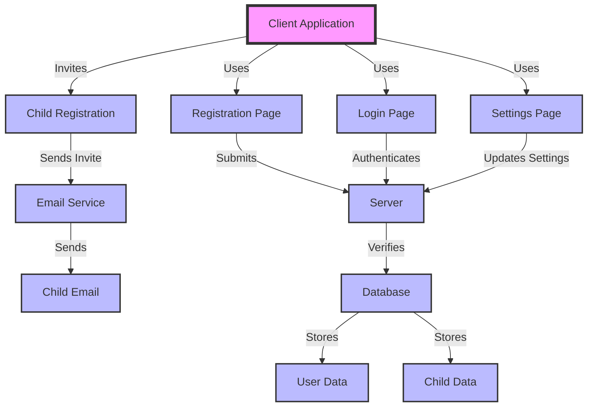
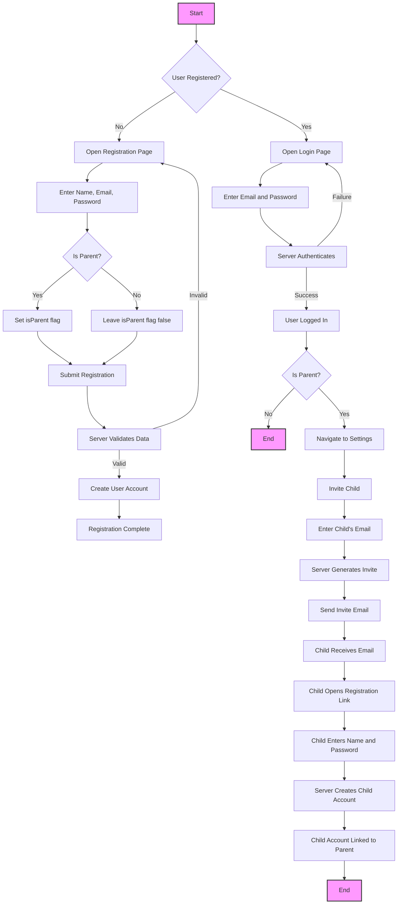

## Authentication - Registration / Login Flow

### Architecture



### Process



### API

#### 1. Registration API

**Endpoint**: `POST /api/register`

**Request Body**:
```json
{
    "name": "string",
    "email": "string",
    "password": "string",
    "isParent": "boolean"
}
```

**Response**:
- **201 Created**: When registration is successful.
- **400 Bad Request**: If the input data is incorrect.

#### 2. Login API

**Endpoint**: `POST /api/login`

**Request Body**:
```json
{
    "email": "string",
    "password": "string"
}
```

**Response**:
- **200 OK**: Returns user session info.
- **401 Unauthorized**: If credentials are incorrect.

#### 3. Invite Child API

**Endpoint**: `POST /api/invite`

**Request Body**:
```json
{
    "parentEmail": "string",
    "childEmail": "string"
}
```

**Response**:
- **200 OK**: When invite is sent successfully.
- **400 Bad Request**: If the email format is incorrect.

#### 4. Child Registration API

**Endpoint**: `POST /api/register-child`

**Request Body**:
```json
{
    "name": "string",
    "email": "string",
    "password": "string",
    "inviteToken": "string"
}
```

**Response**:
- **201 Created**: When child registration is successful.
- **400 Bad Request**: If the input data is incorrect or the invite token is invalid.
