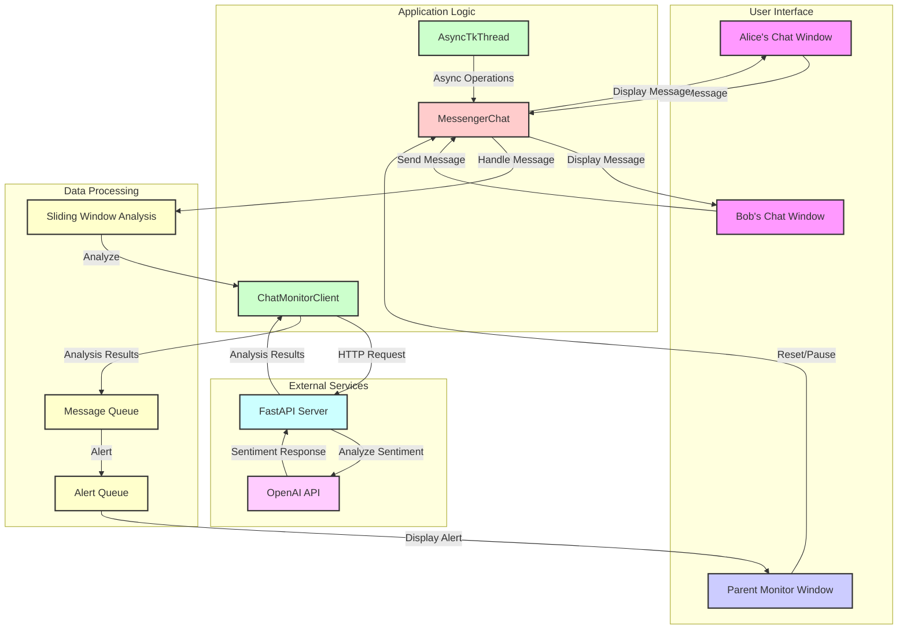
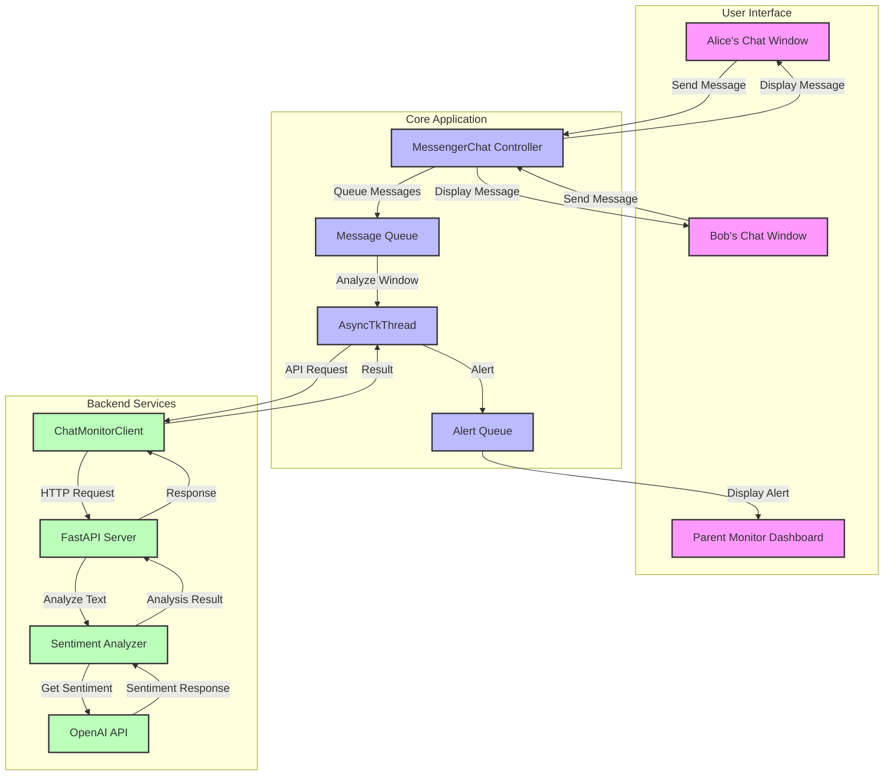

```mermaid
graph TB
    subgraph "User Interface"
        A[Alice's Chat Window]
        B[Bob's Chat Window]
        C[Parent Monitor Window]
    end

    subgraph "Application Logic"
        D[MessengerChat]
        E[AsyncTkThread]
        F[ChatMonitorClient]
    end

    subgraph "Data Processing"
        G[Message Queue]
        H[Alert Queue]
        I[Sliding Window Analysis]
    end

    subgraph "External Services"
        J[FastAPI Server]
        K[OpenAI API]
    end

    A -->|Send Message| D
    B -->|Send Message| D
    D -->|Display Message| A
    D -->|Display Message| B
    D -->|Handle Message| I
    I -->|Analyze| F
    F -->|HTTP Request| J
    J -->|Analyze Sentiment| K
    K -->|Sentiment Response| J
    J -->|Analysis Results| F
    F -->|Analysis Results| G
    G -->|Alert| H
    H -->|Display Alert| C
    E -->|Async Operations| D
    C -->|Reset/Pause| D

    style A fill:#f9f,stroke:#333,stroke-width:2px
    style B fill:#f9f,stroke:#333,stroke-width:2px
    style C fill:#ccf,stroke:#333,stroke-width:2px
    style D fill:#fcc,stroke:#333,stroke-width:2px
    style E fill:#cfc,stroke:#333,stroke-width:2px
    style F fill:#cfc,stroke:#333,stroke-width:2px
    style G fill:#ffc,stroke:#333,stroke-width:2px
    style H fill:#ffc,stroke:#333,stroke-width:2px
    style I fill:#ffc,stroke:#333,stroke-width:2px
    style J fill:#cff,stroke:#333,stroke-width:2px
    style K fill:#fcf,stroke:#333,stroke-width:2px

```

```mermaid

graph TB
    subgraph "User Interface"
        A[Alice's Chat Window] 
        B[Bob's Chat Window]
        C[Parent Monitor Dashboard]
    end

    subgraph "Core Application"
        D[MessengerChat Controller]
        E[AsyncTkThread]
        F[Message Queue]
        G[Alert Queue]
    end

    subgraph "Backend Services"
        H[ChatMonitorClient]
        I[FastAPI Server]
        J[Sentiment Analyzer]
        K[OpenAI API]
    end

    %% Message Flow
    A -->|Send Message| D
    B -->|Send Message| D
    D -->|Display Message| A
    D -->|Display Message| B
    
    %% Analysis Flow
    D -->|Queue Messages| F
    F -->|Analyze Window| E
    E -->|API Request| H
    H -->|HTTP Request| I
    I -->|Analyze Text| J
    J -->|Get Sentiment| K
    K -->|Sentiment Response| J
    J -->|Analysis Result| I
    I -->|Response| H
    H -->|Result| E
    E -->|Alert| G
    G -->|Display Alert| C

    %% Styling
    classDef interface fill:#f9f,stroke:#333,stroke-width:2px
    classDef core fill:#bbf,stroke:#333,stroke-width:2px
    classDef backend fill:#bfb,stroke:#333,stroke-width:2px
    
    class A,B,C interface
    class D,E,F,G core
    class H,I,J,K backend

    %% Click handlers
    click A "Alice Chat" "Opens Alice's chat window"
    click B "Bob Chat" "Opens Bob's chat window"
    click C "Monitor" "Opens parent monitoring dashboard"

```